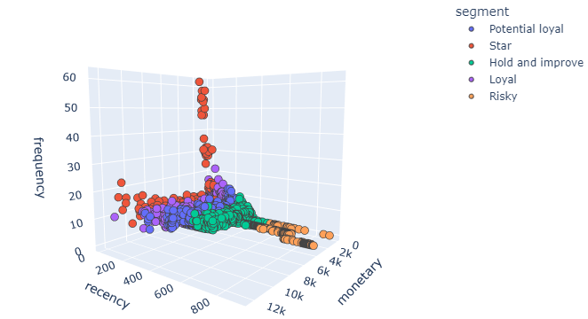

## Customer Segmentation Task

Let's assume that we got a __question__ from our __marketing__ department asking what customers we have.

In order to evaluate what compaigns and strategies to launch, marketing people always need to understand to whom they should address all the __actions to boost__ the sales.

That means that the data analyst task is to somehow __categorize__ or __group the customers__.

One of the oldest and the best known customer __segmentation__ model is __RFM model__. It can be used to measure customer __value__ and show the customer __status__ and sometimes even predict customer __behaviour__.

Although, this is quite an old model, __RFM analysis__ is still widely used today for marketing needs.

And in this project I will take an idea of __RFM__ and utilize a __Unsupervised Machine Learning K-Means Clustering model__.

Check the <a href='rfm_kmeans.ipynb'>jupyter notebook</a> for this analysis
