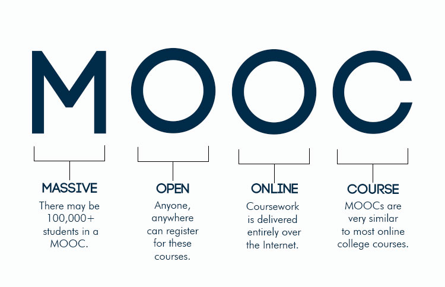
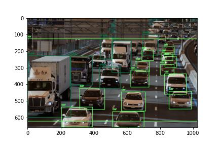

# Machine Learning Projects

### 1) [Fake News Detection](/fake_news_detection/README.md) - __Machine Learning Classification__
   - Data Cleaning and Preprocessing
   - Natural Language Processing
   - Lemmatization
   - Tfidf Vectorization
   - Multinomial Naive Bayes Classifier
   - Classification Metrics

### 2) [Red Wine Quality Prediction](/red_wine_quality/README.md) - __Linear Regression with various models__
   - Data Preprocessing
   - EDA with Visualizations
   - Multiple Linear Regression
   - Ridge Regression
   - Support Vector Regression
   - Decision Tree Regression
   - Random Forest Regression
   - XGBoost

   
### 3) [MOOC User Behaviour Prediction](/MOOC_students_prediction/README.md) - __Classification with Random Forest__
   - Data Preprocessing
   - GridSearchCV
   - ROC-AUC score
   - Random Forest algorithm
   - Train test split

### 4) [House Prices Kaggle Competition](house_prices_competition/house_prices_competition.ipynb) - __Linear Regression with Gradient boosting__
 - Gradient boosting algorithm
 - Preprocessing
 - Missing values handling
 - Pipeline
 - XGBoost

### 5) [Netflix Recommendation System ](netflix_recommendation_system/netflix_rec_system.ipynb) - __Recommender System with sklearn__
 - Data Cleaning
 - Features Engineering
 - Cosine Similarity 
 - Prediction
 

### 6) [Image Recognition, Counting Objects](image_objects_recognition/count_objects.ipynb) - __Computer Vision__
 - OpenCV library
 - Numpy
 - Common objects detection
 - Counting objects

