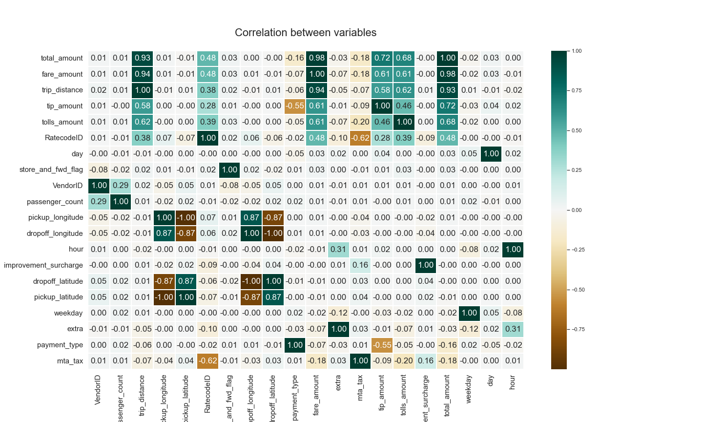

## Taxi Trips Analysis and Price Prediction

The purpose of this project is to demonstrate various techniques for exploring and analyzing data, including descriptive and correlation analysis, creating regression models, identifying key predictor variables, and manipulating existing variables through transformations or additional analysis

Find the [.ipynb](taxi_trips_analysis.ipynb), [.pdf](taxi_trips_analysis.pdf) and [.html](taxi_trips_analysis.html) versions
